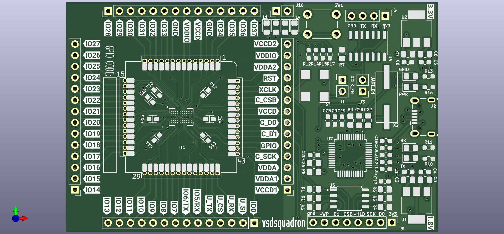
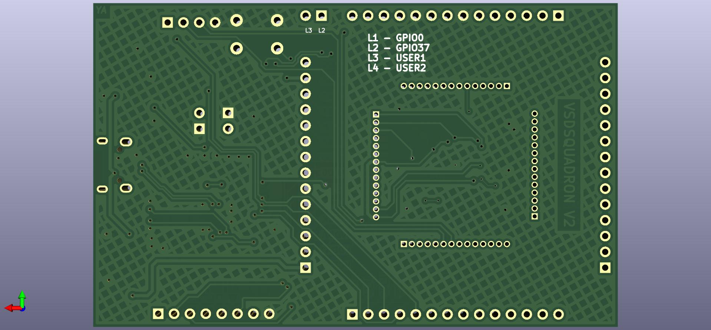

# vsdsquadron documentation


## Mechanical Overview

### Top view

### Bottom view


## Functional Overview

### Block diagram


### Pin Definitions

- J1
- J2
- J3
- J4
- J5
- J10
- Caravel breakout 


### LED 

- PWR LED
- GPIO LED
- RX LED
- TX LED
- L1
- L2
- L3
- L4

## Programming 

### Toolchain setup


- Install `PyFTDI` library support. `PyFTDI` relies on `PyUSB`, which requires a native dependency: libusb 1.x.

```
sudo apt-get install libusb-1.0 libusb-1.0-0-dev
```

- Install the riscv toolchain from:

```
sudo apt-get install gcc-riscv64-unknown-elf
```

In case this does not work, you can get the sources yourself [here](https://github.com/riscv-collab/riscv-gnu-toolchain)

Git clone the caravel_board repository. 

git clone https://github.com/yathAg/vsdsquadron_software.git

### Programming Flow


## Appendix A: Running gpio_test

GPIO test is a simple script to toggle all the GPIOs on the board. The commands below illustrate the process of flashing vsdsquadron with the code.

```
$ cd vsdsquadron_software/firmware/gpio_test
$ make
```
- Make sure Jumper J3 is removed
- Power off the vsdsquadron
- Hold the reset button and run power on the device while holding down the button.
- Run the following command while holding down the button, and after running the command, release the button.

```
$ sudo make flash
```

The script should flash the board and complete with the message in Note 1.
This should result in `L1`, `L2`, and `GPIO Led` blinking with a frequency of 2Hz

>**Note** 1
```
python3 ../util/caravel_hkflash.py gpio_test.hex
Success: Found one matching FTDI device at ftdi://ftdi:232h:1:a/1
 
Caravel data:
   mfg        = 0456
   product    = 11
   project ID = 00000000
 
Resetting Flash...
status = 0x00
 
JEDEC = b'ef4016'
Erasing chip...
done
status = 0x0
setting address to 0x0
addr 0x0: flash page write successful
addr 0x100: flash page write successful
addr 0x200: flash page write successful
addr 0x300: flash page write successful
addr 0x400: flash page write successful
addr 0x500: flash page write successful
addr 0x600: flash page write successful
addr 0x700: flash page write successful
addr 0x800: flash page write successful
setting address to 0x900
addr 0x900: flash page write successful

total_bytes = 2552
status reg_1 = 0x0
status reg_2 = 0x2
************************************
verifying...
************************************
status reg_1 = 0x0
status reg_2 = 0x2
setting address to 0x0
addr 0x0: read compare successful
addr 0x100: read compare successful
addr 0x200: read compare successful
addr 0x300: read compare successful
addr 0x400: read compare successful
addr 0x500: read compare successful
addr 0x600: read compare successful
addr 0x700: read compare successful
addr 0x800: read compare successful
setting address to 0x900
addr 0x900: read compare successful

total_bytes = 2552
pll_trim = b'00'

python3 ../util/caravel_hkstop.py
Success: Found one matching FTDI device at ftdi://ftdi:232h:1:a/1
```

## Appendix B: Transmitting data over UART


```
$ cd vsdsquadron_software/firmware/uart_test
$ make
```
- Make sure Jumper J3 is removed
- Power off the vsdsquadron
- Hold the reset button and run power on the device while holding down the button.
- Run the following command while holding down the button, and after running the command, release the button.

```
$ sudo make flash
```
