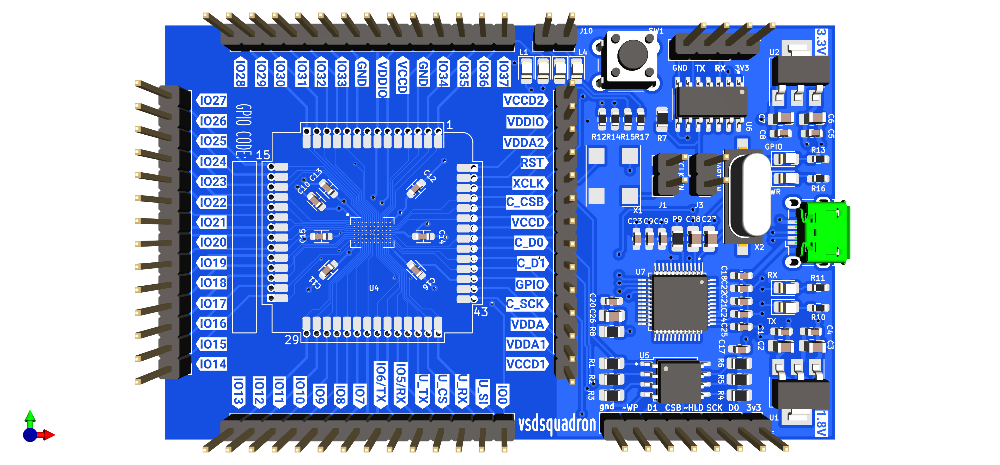
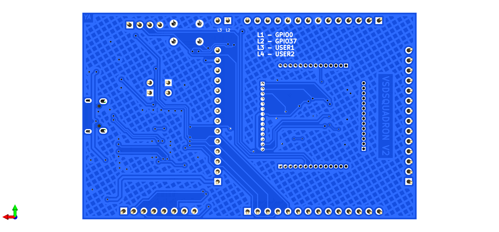
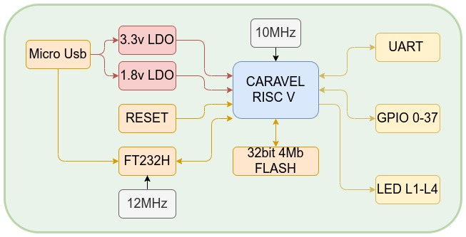
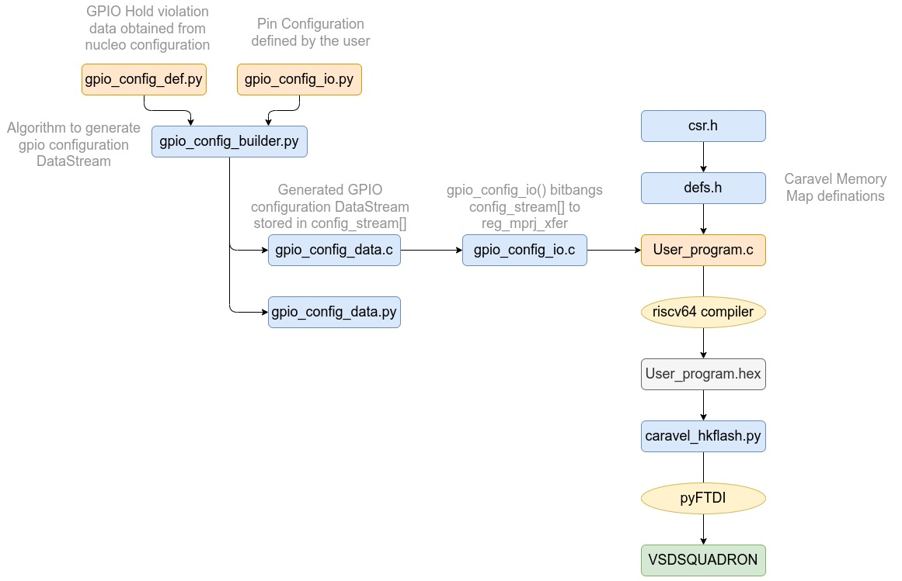

# VSDSQUADRON Documentation

**VSDSQUADRON** is a powerful RISC-V development board that utilizes the MPW2 chips. This board is equipped with a range of useful features, including GPIO, UART, and SPI, making it ideal for a variety of development projects. With a clock speed of 10 MHz, the VSDSQUADRON can handle complex computations and data processing tasks with ease. Additionally, this development board has four leds for output, providing even greater flexibility and versatility. 

## Features

- Caravel MPW2 chip with VexRISC V processor
- 10 Mhz External Oscillator
- 38 General purpose Input Output pins
- UART
- SPI
- 4Mb External Flash
- USB Programming support over FTDI

## Mechanical Overview

### Top view

### Bottom view


## Functional Overview

### Block diagram


### Pin Definitions

| pin Header  | Function | Active Low/High)
| ------------- | ------------- |----- |
| J1  | Caravell clock Enable | Active LOW |
| J2  | Micro USB Connector  |
| J3  | UART enable | Active HIGH |
| J4  | UART Header  |
| J5  | FLASH Header  |
| J10  | User LED Input  |
| Caravel brakout | Direct connection to Caravel IC  |

### LED 

| LED  | Function |
| ------------- | ------------- |
| PWR LED | 3.3V OK |
| GPIO LED  | Management GPIO  |
| RX LED  | FTDI Receive signal |
| TX LED  | FTDI Transmit signal |
| L1| Caravel GPIO 0  |
| L2  | Caravel GPIO 37  |
| L3 | User GPIO 1 |
| L4 | User GPIO 2 |
 
 > The two User GPIO can be connected to any of the 38 GPIO via Jumper cables (J10) according to the required application.

## Programming 

### Toolchain setup


- Install `PyFTDI` library support. `PyFTDI` relies on `PyUSB`, which requires a native dependency: libusb 1.x.

```
sudo apt-get install libusb-1.0 libusb-1.0-0-dev
sudo pip3 uninstall setuptools
sudo apt-get install python3-setuptools
sudo pip3 install pyftdi
```

- Install the riscv toolchain from:

```
sudo apt-get install gcc-riscv64-unknown-elf
```

In case this does not work, you can get the sources yourself [here](https://github.com/riscv-collab/riscv-gnu-toolchain)

Git clone the caravel_board repository. 

git clone https://github.com/yathAg/vsdsquadron_software.git

### Programming Flow



## Appendix A: Running gpio_test

GPIO test is a simple script to toggle all the GPIOs on the board. The commands below illustrate the process of flashing vsdsquadron with the code.

```
$ cd vsdsquadron_software/firmware/gpio_test
$ make PART=<part_id>
```
- Make sure Jumper J3 is removed
- Power off the vsdsquadron
- Hold the reset button and run power on the device while holding down the button.
- Run the following command while holding down the button, and after running the command, release the button.

```
$ sudo make flash
```

The script should flash the board and complete with the message in Note 1.
This should result in `L1`, `L2`, and `GPIO Led` blinking with a frequency of 2Hz

>**Note** 1
```
python3 ../util/caravel_hkflash.py gpio_test.hex
Success: Found one matching FTDI device at ftdi://ftdi:232h:1:a/1
 
Caravel data:
   mfg        = 0456
   product    = 11
   project ID = 00000000
 
Resetting Flash...
status = 0x00
 
JEDEC = b'ef4016'
Erasing chip...
done
status = 0x0
setting address to 0x0
addr 0x0: flash page write successful
addr 0x100: flash page write successful
addr 0x200: flash page write successful
addr 0x300: flash page write successful
addr 0x400: flash page write successful
addr 0x500: flash page write successful
addr 0x600: flash page write successful
addr 0x700: flash page write successful
addr 0x800: flash page write successful
setting address to 0x900
addr 0x900: flash page write successful

total_bytes = 2552
status reg_1 = 0x0
status reg_2 = 0x2
************************************
verifying...
************************************
status reg_1 = 0x0
status reg_2 = 0x2
setting address to 0x0
addr 0x0: read compare successful
addr 0x100: read compare successful
addr 0x200: read compare successful
addr 0x300: read compare successful
addr 0x400: read compare successful
addr 0x500: read compare successful
addr 0x600: read compare successful
addr 0x700: read compare successful
addr 0x800: read compare successful
setting address to 0x900
addr 0x900: read compare successful

total_bytes = 2552
pll_trim = b'00'

python3 ../util/caravel_hkstop.py
Success: Found one matching FTDI device at ftdi://ftdi:232h:1:a/1
```

## Appendix B: Transmitting data over UART

### Installing and running serial terminal to see messages 

To install picocom 
```
sudo apt install picocom
```

Launch picocom using
```
picocom -b 9600 /dev/serial/by-id/usb-FTDI_Single_RS232-HS-if00-port0
```
- `-b` defines the baud rate
- `/dev/serial/by-id/usb-FTDI_Single_RS232-HS-if00-port0` is the serial id of the board it can also be found using

```
ls /dev/serial/by-id/
```

### Flashing UART code and viewing data
```
$ cd vsdsquadron_software/firmware/uart_test
$ make PART=<part_id>
```
- Make sure Jumper J3 is removed
- Power off the vsdsquadron
- Hold the reset button and run power on the device while holding down the button.
- Run the following command while holding down the button, and after running the command, release the button.

```
$ sudo make flash
```

- Connect J3 & Power Cycle the board ( Turn off and then Turn On)
- Open serial terminal to see the message `Hello from VSDSQUADRON`

## Appendix C: Important VSDsquadron Registers

### GPIO 
- `reg_gpio_mode1` - Management GPIO drive strength Configuration
- `reg_gpio_mode0` - Management GPIO drive strength Configuration
- `reg_gpio_ien`   - Management GPIO output enable
- `reg_gpio_oe`    - Management GPIO input enable
- `reg_gpio_in`    - Management GPIO input
- `reg_gpio_out`   - Management GPIO output

### UART 
- `reg_uart_data`      - Rx/Tx data
- `reg_uart_txfull`    - Transmit buffer full status
- `reg_uart_rxempty`   - Receive buffer empty status
- `reg_uart_enable`    - Enable UART

### User Project Control 
- `reg_mprj_xfer`    - GPIO configuration control register
- `reg_mprj_datal`   - GPIO I/O value of GPIO[31] to GPIO[0]
- `reg_mprj_datah`   - GPIO I/O value of GPIO[37] to GPIO[32]


>`reg_mprj_datal` (32 bits) is the value of GPIO[31] to GPIO[0], respectively where the bit position matches the GPIO channel.  
>Since there are more than 32 GPIO channels, the rest of them go into `reg_mprj_datah` (32 bits, only the low 6 bits are used) is the value of GPIO[37] to GPIO[32]. Everything above the 6th bit reads zero.

### Individual GPIO Mode

Each GPIO can be configured to a specific functionality using the reg_mprj_io_<pin> register. 

`reg_mprj_io_0`
.
.
.
`reg_mprj_io_37` 

The possible configurations are Listed below and an example for the configuration is 

```
reg_mprj_io_0 = GPIO_MODE_MGMT_STD_BIDIRECTIONAL //sets GPIO0 to bidirectional pin
```

### GPIO mode values
- GPIO_MODE_MGMT_STD_INPUT_PULLDOWN
- GPIO_MODE_MGMT_STD_INPUT_PULLUP	 
- GPIO_MODE_MGMT_STD_BIDIRECTIONAL 
- GPIO_MODE_USER_STD_INPUT_PULLDOWN
- GPIO_MODE_USER_STD_INPUT_PULLUP	 
- GPIO_MODE_USER_STD_OUTPUT	     
- GPIO_MODE_USER_STD_BIDIRECTIONAL 
- GPIO_MODE_USER_STD_OUT_MONITORED 
- GPIO_MODE_MGMT_STD_INPUT_NOPULL	  
- GPIO_MODE_MGMT_STD_OUTPUT	      
- GPIO_MODE_MGMT_STD_ANALOG	      
- GPIO_MODE_USER_STD_INPUT_NOPULL	  
- GPIO_MODE_USER_STD_ANALOG	      


