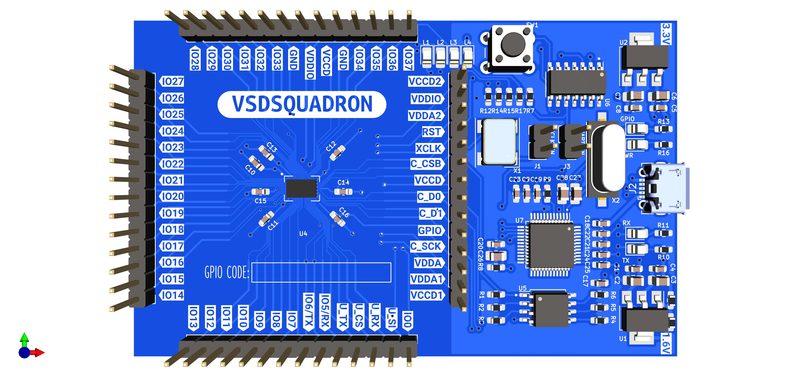

# VSDSQUADRON

VSDSquadron, a cutting-edge development board based on the RISC-V architecture that is fully open-source. This board presents an exceptional opportunity for individuals to learn about RISC-V and VLSI chip design utilizing only open-source tools, starting from the RTL and extending all the way to the GDSII. The possibilities for learning and advancement with this technology are limitless.

Furthermore, the RISC-V chips on these boards should be open for VLSI chip design learning, allowing you to explore PNR, standard cells, and layout design. And guess what? vsdsquadron is the perfect solution for all your needs! With its comprehensive documentation and scalable labs, thousands of students can learn and grow together.

For more information visit [https://www.vlsisystemdesign.com/vsdsquadron/](https://www.vlsisystemdesign.com/vsdsquadron/)